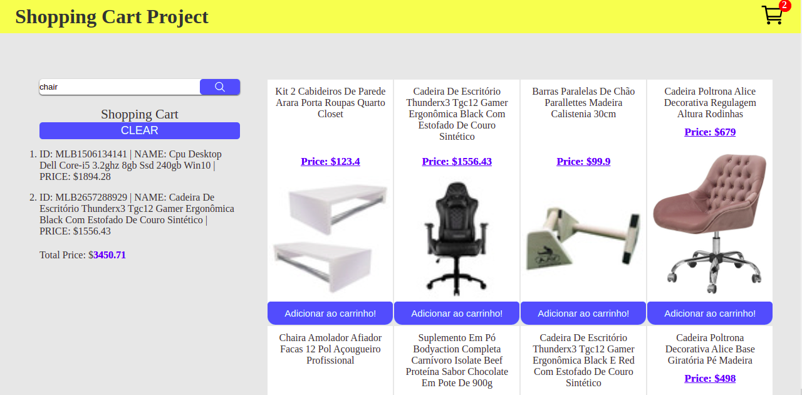

# Shopping Cart

  
<h2>:brazil: Português</h2>

  Esse projeto foi desenvolvido enquanto estudando Fundamentos de Desenvolvimento Web no curso da Trybe, com o fim educacional de exercitar funções assíncronas.  Nesse projeto é possível se realizar pesquisas na API do Mercado Livre, adicionar os produtor em um carrinho, remover um produto do carrinho ao clicar sobre o seu nome, limpar o carrinho e salvar os produtos do carrinho no localstorage para posteriormente continuar com o carrinho cheio.
  
  ## Live Link
  <a href="https://educational-shopping-cart.netlify.app/">Shopping Cart Project</a>
  
  ## Screenshot
  
  
  ## Objetivos
  * Mostrar a mensagem de Loading enquanto carregando;
  * Implementar a funcionalidade de limpar o carrinho;
  * Mostrar o valor total do carrinho;
  * Salvar dados de carrinho no localstorage e buscar ao voltar na página;
  * Remover item do carrinho ao clicar sobre ele;
  * Adicionar o produto no carrinho;
  * Listar os produtos vindo da API.
  
  ## Tecnologias usadas
  * HTML
  * CSS
  * Javacript
  * DOM
  * HTML Semântico
  * Funções assíncronas de aquisição de dados em API
  
  ## Como usar
  Basta acessar a página e explorar as funcionalidades do carrinho de compra ( adicionar ao carrinho, remover, verificar total, verificar localstorage).
      
  ## Rodar Localmente
  ### Requisitos:
   * Google Chrome
   * VS Code (com a extensão Live Server)
    
  ### Clonar no seu computador (via SSH)
  No terminal:
  
    git clone git@github.com:IgorMarinhoArgollo/quidditch-signup.git
  

  ### Iniciando o projeto localmente
  Abra o projeto com o VS code e rode o projeto com a extensão Live Server
   
  ## Informações de Desenvolvimento
  Commits de Desenvolvimento: 15;  
  Tempo Gasto: 3 dias;

  
  ##  
This project was developed while studying Fundamentals of Web Development in the Trybe course, for educational purpose of exercising asynchronous functions.  In this project it is possible to carry out research on the API of the Mercado Livre(online store), add products to a cart, remove a product from the cart by clicking on its name, clearing the cart and saving the products in the cart to localstorage.

## Live Link
<a href="https://educational-shopping-cart.netlify.app/">Shopping Cart Project</a>
   
## Screenshot

  
## My Goals
* Show Loading message while fetching data;
* Allow clear cart functionality;
* Show total cart value;
* Save cart data on localstorage;
* Remove itens on cart over click on it;
* Add product on cart;
* List products of API.

## Used Technologies
  * HTML
  * CSS
  * Javacript
  * DOM
  * Semantic HTML
  * Async Functions with API Fetchs

## How to use it
  Just go to the page and explore cart functionalities considering it was an educational project.
    
## Run Locally
  ### Requirements:
   * Google Chrome
   * VS Code (with Live Server extension)
    
  ### Cloning into your computer (via SSH)
  On terminal:

      git clone git@github.com:IgorMarinhoArgollo/quidditch-signup.git

  ### Starting project locally
  Open the project with VS Code and run it with the Live Server Extension.
  
## Development Information
  Development Commits: 15;  
  Time Spent: 3 days;   
  
